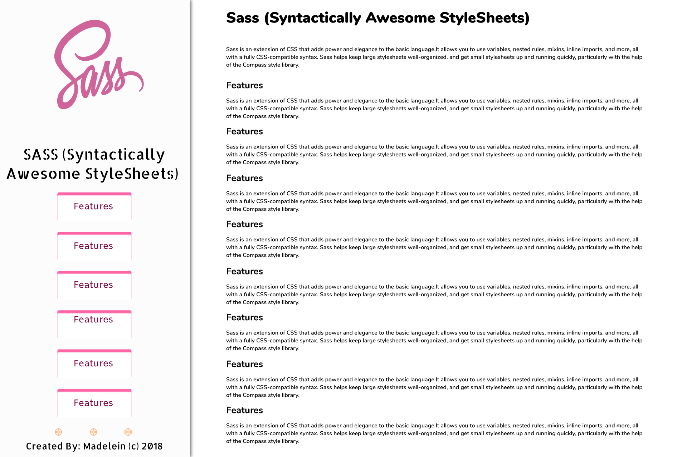
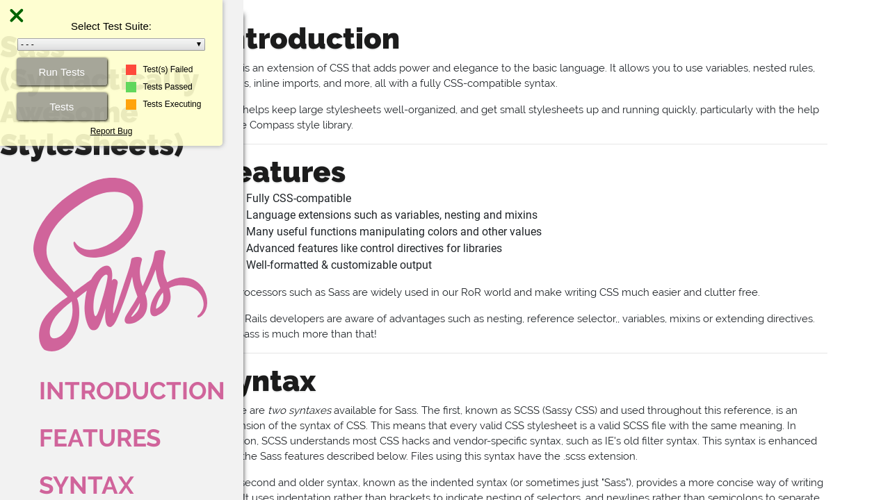

# FCC (FreeCodeCamp) - Tribute Page
---

## Project Objective
Build an app that is *functionally* similar to this: https://codepen.io/freeCodeCamp/full/zNqgVx.

***

## Requirements
#### Requirement Number One:
A main element with a ```id="main-doc"```, which contains the page's main content (technical documentation). Within the ```#main-doc element```, I can see several ```section elements```, each with a class of ```main-section```. There should be a minimum of 5.

#### Requirement Number Two: 
The first element within each ```.main-section``` should be a header element which contains text that describes the topic of that section. Each section element with the ```class of main-section``` should also have an ```id``` that corresponds with the text of each header contained within it.

The ```.main-section``` elements should contain at least ```10 p```, ```5 code elements```,```5 li items```.

#### Requirement Number Three: 
I can see a ```nav``` element with a corresponding ```id="navbar"```. The navbar element should contain one header element which contains text that describes the topic of the technical documentation. Additionally, the navbar should contain ```link (a)``` elements with the class of ```nav-link```.

The ```header``` element in the navbar must come before any ```link (a)``` elements in the navbar. Each element with the class of nav-link should contain text that corresponds to the header text within each section. When I click on a ```navbar element```, the page should navigate to the corresponding section of the main-doc element. 

#### Requirement Number Four: 
On regular sized devices (laptops, desktops), the element with id="navbar" should be shown on the left side of the screen and should always be visible to the user & should use at least one media query.

***

## Project Install Requirements

- **NodeJS - [NodeJS](http://nodejs.org)** - Follow the prompts to install
- **Gulp - [GulpJS](https://gulpjs.com/)**
```
npm install -g gulp
```

***

## Start Project
Run the following command: 
```
npm install
```

***

## How to use the project
Open your terminal and type gulp. This will run the ```gulpfile``` and ensure that all the compilers are working and watching for any changes taking place.

Here are other commands that you can run.

* **default**: Compile and watch for changes
* **scripts**: Compile the JavaScript files
* **sass**: Compile the Sass styles
* **images**: Copy the newer to the build folder
* **vendors**: Copy the vendors to the build folder
* **watch**: Watch for any changes on the each section

The `gulp` command is the best choice for you most likley.

***

## Project Starter Kit
Courtesy of: **Jesse Showalter** 
Go check out his [YouTube](https://www.youtube.com/watch?v=sr6jDeAoXCc&feature=youtu.be&list=PLrtjkLnNjGHu7QIc8jN7hZmuP6wMby2QZ) channel for more information and awesome content.

## Project Thumbnails:




